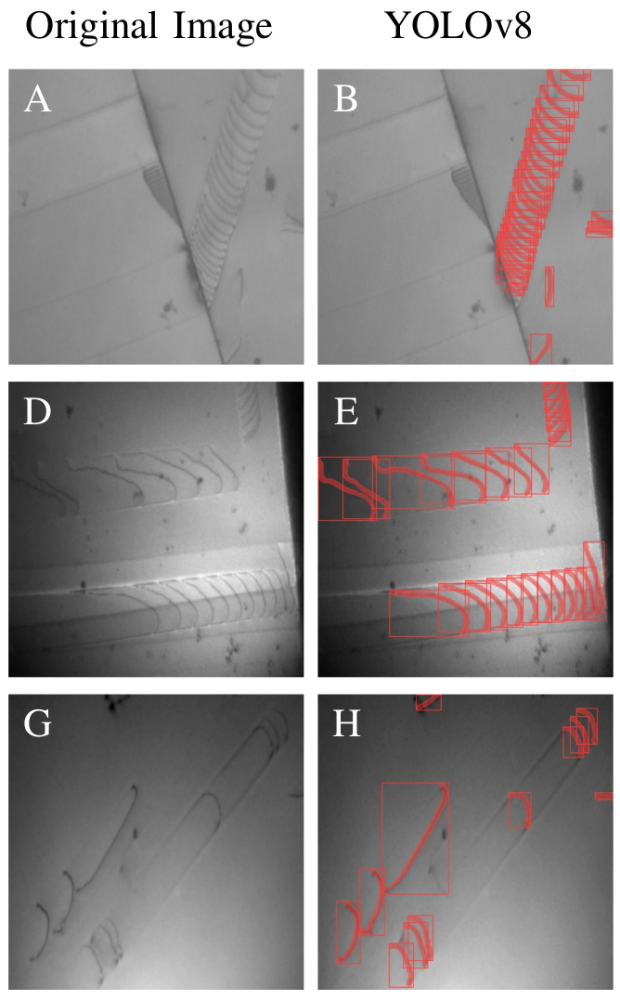
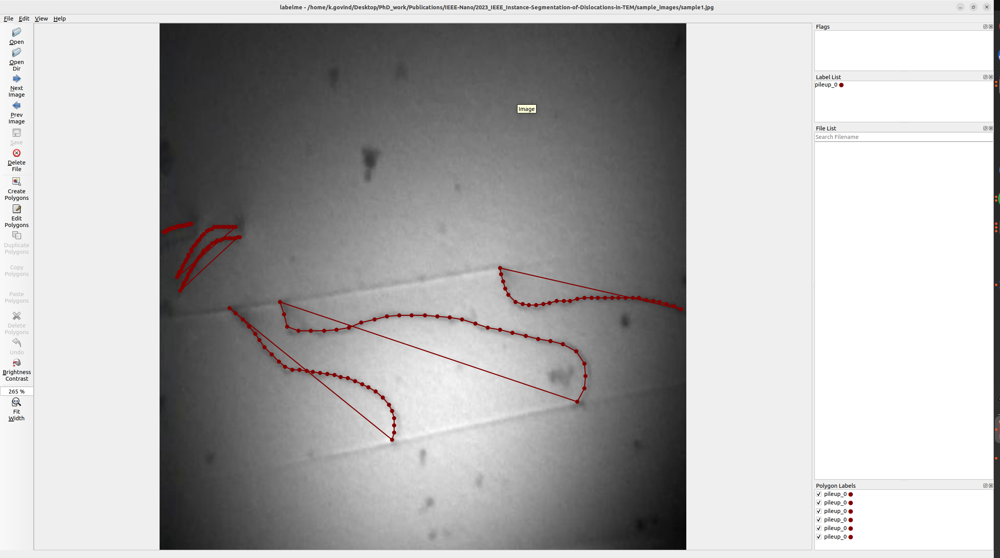

# 2023_IEEE_Instance-Segmentation-of-Dislocations-in-TEM

This repo is the implementation of the physical based metric to evaluate Machine learning models to segment dislocations in TEM images of dislocation microstructure. For more details please refer our paper [Instance Segmentation of Dislocations in TEM Images](URL here). 

## A Quick Overview 
We use Yolov8 model from [Ultralytics](https://github.com/ultralytics/ultralytics) to perform instance segmentation on Real TEM data which is handlabelled using [RoboloFlow](https://roboflow.com/). We add our [physical based evaluation metric](./ultralytics/ultralytics/yolo/v8/segment/loss.py) to the yolov8 model.  

<div align="center">
  
  <br>
  <b>Instance segmentation of the TEM images of dislocation microstructure using Yolov8</b>
</div>


## Requirement
Since the metric is integerated in the yolo framework, you just need to clone this repository using 

``git clone https://gitlab.com/computational-materials-science/public/publication-data-and-code/2023_IEEE_Instance-Segmentation-of-Dislocations-in-TEM.git``

Create a python environment and install ultralytics package locally using 

```bash
pip install -r requirements.txt

cd ultralytics 

pip install -e . 

```
Download the [checkpoint](https://drive.google.com/file/d/1ABDDwBTycn-z8JIRTqfRIQlycoHlMQNc) of the model and create a directory checkpoint and place it there . 

The dataset is provided as a zip file "datasets.zip". you may unzip this file and get the complete dataset used in our work. Some of the sample TEM images of dislocation microstructure to test the code can be found at ./sample_images. 

## Usage 
### Prediction on new TEM images  
A jupyter notebook [Predict](./Jupyternotebook/Predict.ipynb) can be  used to start making predictions using checkpoint provided by our training. To make the predictions one can directly install the YOLO using 
```bash
pip install ultralytics
```  
and download the checkpoint as explained above and start making predictions. 

### Prediction and representing dislocations as splines. 
The dislocation masks obtained from predictions using the Yolo can be further processed to represent each dislocation as spline. You may use 
Jupyter notebook [Predict_extract_spline](./Jupyternotebook/Predict_extract_spline.ipynb) that can be used to represent each dislocation as spline. The notebook can be used to generate a json file which can be used in [labelme](https://github.com/wkentaro/labelme). 

<div align="center">
  
  <br>
  <b>Representing each dislocation as spline </b>
</div>
It might be useful in case of finetuning the model on your own data. The steps need to be followed to finetune the model on your own data are 

1. Use [Predict_extract_spline](./Jupyternotebook/Predict_extract_spline.ipynb) to obtain JSON files for your TEM images.

2. Use Labelme to open the JSON files and make necessary corrections to the support points of the splines which represent the dislocations. You may move the points, delete them, or annotate any dislocation which is not predicted by the model. Once done, save and it will save the JSON file.

3. Now you have the labelled data which has been corrected. This data can now be converted to COCO format as explained in [labelme](https://github.com/wkentaro/labelme/tree/main/examples/instance_segmentation) for the instance segmentation task.

4. You may now fine-tune the model on your own data using YOLO. Make sure to load our checkpoint before training the model.


Please create an issue if you any problems, we will get back to you and fix it. 
## Cite
Please cite 
